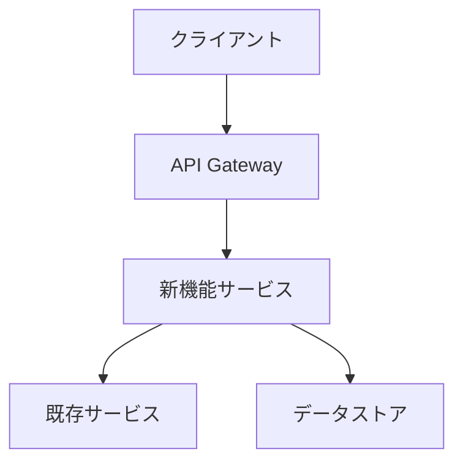
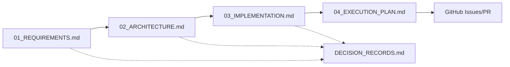

# 新機能開発フレームワーク

tsumesyoプロジェクトにおける新機能開発を体系的に管理するためのフレームワークです。

## 📋 開発フェーズと成果物

### Phase 1: 要件定義 (Requirements)
**目的**: ユーザーのやりたいことを明確化する

#### 成果物: `docs/features/[機能名]/01_REQUIREMENTS.md`

```markdown
# [機能名] 要件定義書

## 1. ビジネス要件
### 1.1 背景
- なぜこの機能が必要か
- 現在の課題は何か

### 1.2 目的
- この機能で何を達成したいか
- ユーザーにどんな価値を提供するか

### 1.3 スコープ
#### 含むもの
- [ ] 機能A
- [ ] 機能B

#### 含まないもの
- [ ] 機能X（将来的に検討）

## 2. ユーザーストーリー
### ストーリー1: [タイトル]
**As a** [ユーザータイプ]  
**I want to** [やりたいこと]  
**So that** [得られる価値]

**受け入れ条件**:
- [ ] 条件1
- [ ] 条件2

## 3. 機能要件
### FR-1: [要件名]
- 説明: 
- 優先度: 高/中/低
- 依存関係: 

## 4. 非機能要件
### パフォーマンス
- レスポンスタイム: X秒以内
- 同時接続数: Y件

### セキュリティ
- 認証方式: 
- データ保護: 

## 5. 制約事項
- 技術的制約
- ビジネス制約
- リソース制約

## 6. 成功指標
- KPI1: 
- KPI2: 
```

---

### Phase 2: アーキテクチャ設計 (Architecture)
**目的**: 技術的な全体像と主要コンポーネントを設計する

#### 成果物: `docs/features/[機能名]/02_ARCHITECTURE.md`

```markdown
# [機能名] アーキテクチャ設計書

## 1. アーキテクチャ概要
### 1.1 システム構成図


### 1.2 設計原則
1. **原則1**: [説明]
2. **原則2**: [説明]

## 2. コンポーネント設計
### 2.1 [コンポーネント名]
- **責務**: 
- **インターフェース**: 
- **依存関係**: 

## 3. データ設計
### 3.1 データモデル
```sql
CREATE TABLE [table_name] (
    id STRING NOT NULL,
    ...
);
```

### 3.2 データフロー
1. クライアントから[データ]を受信
2. [処理]を実行
3. [結果]を返却

## 4. API設計
### 4.1 エンドポイント一覧
| メソッド | パス | 説明 |
|---------|------|------|
| POST | /api/v1/[resource] | [説明] |

### 4.2 API仕様
```yaml
openapi: 3.0.0
paths:
  /api/v1/[resource]:
    post:
      summary: [説明]
      requestBody:
        content:
          application/json:
            schema:
              type: object
```

## 5. セキュリティ設計
- 認証・認可方式
- データ暗号化
- 監査ログ

## 6. 拡張性考慮事項
- スケーリング戦略
- 将来の機能拡張ポイント
```

---

### Phase 3: 実装設計 (Implementation)
**目的**: 具体的な実装方法を詳細化する

#### 成果物: `docs/features/[機能名]/03_IMPLEMENTATION.md`

```markdown
# [機能名] 実装設計書

## 1. 実装方針
### 1.1 技術スタック
- 言語: Python 3.12
- フレームワーク: FastAPI, LangChain
- ライブラリ: [使用するライブラリ]

### 1.2 コーディング規約
- [プロジェクトの規約に従う]

## 2. モジュール構成
```
src/
├── features/
│   └── [機能名]/
│       ├── __init__.py
│       ├── models.py      # データモデル
│       ├── services.py    # ビジネスロジック
│       ├── api.py        # APIエンドポイント
│       └── utils.py      # ユーティリティ
```

## 3. 詳細実装
### 3.1 [モジュール名]
```python
# models.py
from pydantic import BaseModel

class [ModelName](BaseModel):
    """[説明]"""
    field1: str
    field2: int
```

### 3.2 エラーハンドリング
```python
class [Feature]Error(Exception):
    """基底例外クラス"""
    pass

class [Specific]Error([Feature]Error):
    """特定のエラー"""
    pass
```

## 4. 設定管理
```python
# config.py
class [Feature]Config:
    option1: str = "default"
    option2: int = 100
```

## 5. テスト戦略
### 5.1 単体テスト
```python
# test_[module].py
def test_[function_name]():
    # Arrange
    # Act
    # Assert
```

### 5.2 統合テスト
- シナリオ1: [説明]
- シナリオ2: [説明]

## 6. ログ設計
```python
logger.info("[Feature] 処理開始", extra={"user_id": user_id})
logger.error("[Feature] エラー発生", exc_info=True)
```
```

---

### Phase 4: 実行計画 (Execution Plan)
**目的**: タスクの分割と実行スケジュールを管理する

#### 成果物: `docs/features/[機能名]/04_EXECUTION_PLAN.md`

```markdown
# [機能名] 実行計画書

## 1. マイルストーン
| マイルストーン | 期日 | 成果物 |
|---------------|------|--------|
| M1: 設計完了 | YYYY-MM-DD | 設計書一式 |
| M2: 基本実装完了 | YYYY-MM-DD | コア機能 |
| M3: テスト完了 | YYYY-MM-DD | テスト済みコード |
| M4: リリース | YYYY-MM-DD | 本番デプロイ |

## 2. タスク分解 (WBS)
### Phase 1: 基盤整備 (X日)
- [ ] T1.1: 開発環境セットアップ (0.5日)
- [ ] T1.2: 依存ライブラリ追加 (0.5日)
- [ ] T1.3: 基本構造の作成 (1日)

### Phase 2: コア機能実装 (Y日)
- [ ] T2.1: データモデル実装 (1日)
  - [ ] T2.1.1: Pydanticモデル定義
  - [ ] T2.1.2: バリデーション実装
- [ ] T2.2: ビジネスロジック実装 (2日)
- [ ] T2.3: APIエンドポイント実装 (1日)

### Phase 3: テスト (Z日)
- [ ] T3.1: 単体テスト作成 (1日)
- [ ] T3.2: 統合テスト作成 (1日)
- [ ] T3.3: E2Eテスト実行 (0.5日)

### Phase 4: ドキュメント・デプロイ (W日)
- [ ] T4.1: APIドキュメント更新 (0.5日)
- [ ] T4.2: デプロイ準備 (0.5日)
- [ ] T4.3: 本番リリース (0.5日)

## 3. リソース計画
### 必要なリソース
- 開発者: X名
- レビュアー: Y名
- インフラ: [必要なリソース]

### 依存関係
- [他チームとの調整事項]
- [外部サービスの準備]

## 4. リスク管理
| リスク | 影響度 | 発生確率 | 対策 |
|--------|--------|----------|------|
| [リスク1] | 高 | 中 | [対策] |
| [リスク2] | 中 | 低 | [対策] |

## 5. コミュニケーション計画
- 日次: スタンドアップ
- 週次: 進捗レビュー
- 完了時: デモ・振り返り

## 6. 完了条件 (Definition of Done)
- [ ] 全機能要件を満たしている
- [ ] テストカバレッジ80%以上
- [ ] コードレビュー完了
- [ ] ドキュメント更新完了
- [ ] パフォーマンス基準を満たしている
```

---

## 🔄 ドキュメント間の関係



## 📝 運用ルール

### 1. フォルダ構造
```
docs/
├── features/                    # 機能別ドキュメント
│   └── [機能名]/
│       ├── 01_REQUIREMENTS.md
│       ├── 02_ARCHITECTURE.md
│       ├── 03_IMPLEMENTATION.md
│       └── 04_EXECUTION_PLAN.md
├── DECISION_RECORDS.md         # 意思決定記録
└── FEATURE_DEVELOPMENT_FRAMEWORK.md  # このファイル
```

### 2. レビュープロセス
1. **要件定義**: ビジネスオーナーとレビュー
2. **アーキテクチャ**: テックリードとレビュー
3. **実装設計**: 開発チームとレビュー
4. **実行計画**: プロジェクトマネージャーとレビュー

### 3. 更新タイミング
- 各フェーズ完了時に次フェーズのドキュメントを作成
- 変更があった場合は関連ドキュメントも更新
- 重要な意思決定は`DECISION_RECORDS.md`に記録

### 4. バージョン管理
- Gitで管理し、PRでレビュー
- タグ: `feature/[機能名]-docs`
- ブランチ: `feature/[機能名]`

## 🎯 このフレームワークの利点

1. **明確な責任分離**: 各フェーズで考えるべきことが明確
2. **トレーサビリティ**: 要件から実装まで追跡可能
3. **並行作業**: ドキュメントを基に複数人で作業可能
4. **品質保証**: 各フェーズでレビューによる品質チェック
5. **ナレッジ共有**: 将来の開発の参考資料として活用

---

次の新機能開発時は、このフレームワークに従ってドキュメントを作成してください。