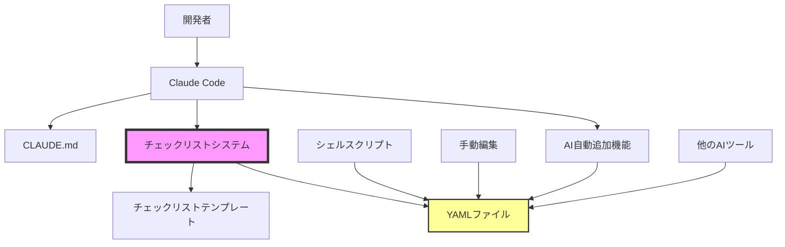

# AI開発コラボレーション チェックリスト機能 アーキテクチャ設計書

## 1. アーキテクチャ概要
### 1.1 システム構成図


### 1.2 設計原則
1. **シンプルさ優先**: YAMLという人間が読み書きしやすいフォーマットを採用
2. **AI連携重視**: AIが容易に理解・操作できる構造
3. **拡張性**: 新しいカテゴリや項目を簡単に追加可能
4. **ポータビリティ**: ファイルベースで環境依存なし

## 2. コンポーネント設計
### 2.1 チェックリストファイル（YAML）
- **責務**: チェック項目の定義と管理
- **インターフェース**: YAMLフォーマット
- **依存関係**: なし（スタンドアロン）

### 2.2 CLAUDE.md
- **責務**: AIへの指示とガイドライン提供
- **インターフェース**: Markdownドキュメント
- **依存関係**: Claude Codeが読み込み

### 2.3 チェックリストテンプレート
- **責務**: 汎用的なチェック項目の提供
- **インターフェース**: YAMLファイル（template.yaml）
- **依存関係**: なし

### 2.4 AI自動追加機能
- **責務**: 自然言語からチェック項目を生成・追加
- **インターフェース**: CLAUDE.md経由の指示
- **依存関係**: YAMLファイル構造の理解

## 3. データ設計
### 3.1 データモデル
```yaml
# チェックリストのスキーマ
metadata:
  name: string                    # チェックリスト名
  version: string                 # バージョン
  description: string             # 説明
  created_at: date               # 作成日
  tags: [string]                 # タグ

categories:
  - name: string                 # カテゴリ名
    id: string                   # カテゴリID
    description: string          # カテゴリ説明
    items:
      - id: string               # 項目ID
        question: string         # 確認質問
        severity: enum           # 重要度 (critical/high/medium/low)
        hint: string             # 確認のヒント

automated_checks:                # 自動チェック可能な項目（オプション）
  - id: string
    type: string                 # チェックタイプ
    target: string               # チェック対象
    pattern: string              # パターン（正規表現等）
    message: string              # メッセージ
```

### 3.2 データフロー
1. 開発者がチェックリストを作成/編集
2. AIがCLAUDE.mdの指示に基づいて項目を追加
3. 開発時にチェックリストを参照
4. 必要に応じてカスタマイズ

## 4. API設計
### 4.1 ファイル操作インターフェース
| 操作 | 説明 | 実装方法 |
|------|------|----------|
| 読み込み | YAMLファイルの読み込み | ファイルシステム |
| 書き込み | YAMLファイルの更新 | ファイルシステム |
| 検証 | YAML構造の検証 | YAMLパーサー |

### 4.2 AI操作インターフェース
```markdown
# CLAUDE.mdでの指示形式
- カテゴリの自動判定ルール
- 重要度の判定基準
- 項目追加時のフォーマット
```

## 5. セキュリティ設計
- **アクセス制御**: ファイルシステムの権限に依存
- **データ検証**: YAML構造の妥当性チェック
- **機密情報**: チェックリストに機密情報を含めないよう注意喚起

## 6. 拡張性考慮事項
### 将来の拡張ポイント
1. **Web UI**: ブラウザベースの管理画面
2. **自動実行**: チェック項目の自動実行エンジン
3. **レポート生成**: チェック結果のレポート機能
4. **統合**: CI/CDパイプラインへの統合
5. **共有**: チェックリストの共有・配布機能
6. **バージョン管理**: チェックリストの履歴管理

### 拡張時の設計方針
- YAMLフォーマットは維持（後方互換性）
- 新しいフィールドは optional として追加
- 既存の動作を変更しない